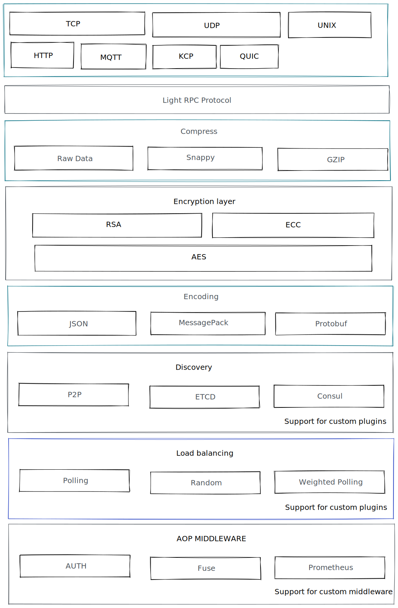

# light
LightRPC Multi-protocol encryption RPC

### Multi-protocol
- [x] TCP
- [x] KCP
- [x] UNIX
- [ ] HTTP
- [ ] MQTT
- [ ] QUIC

### Encoding
- [x] JSON
- [x] MessagePack
- [ ] Protobuf

### Compress
- [x] RawData
- [x] Snappy
- [x] GZIP

### Discovery
- [x] p2p
- [x] redis `docker run -d --name redis -p 6379:6379 --restart=always  redis:6-alpine`
- [ ] etcd
- [ ] consul

## Programming language support
- [x] GO
- [ ] RUST
- [ ] Python

## TODO
- [x] Heartbeat
- [x] Client connection pool
- [x] Auth
- [x] Discovery
- [x] Middleware
- [x] Limit
- [x] [Performance Testing](https://github.com/dollarkillerx/light_rpc_benchmark)
